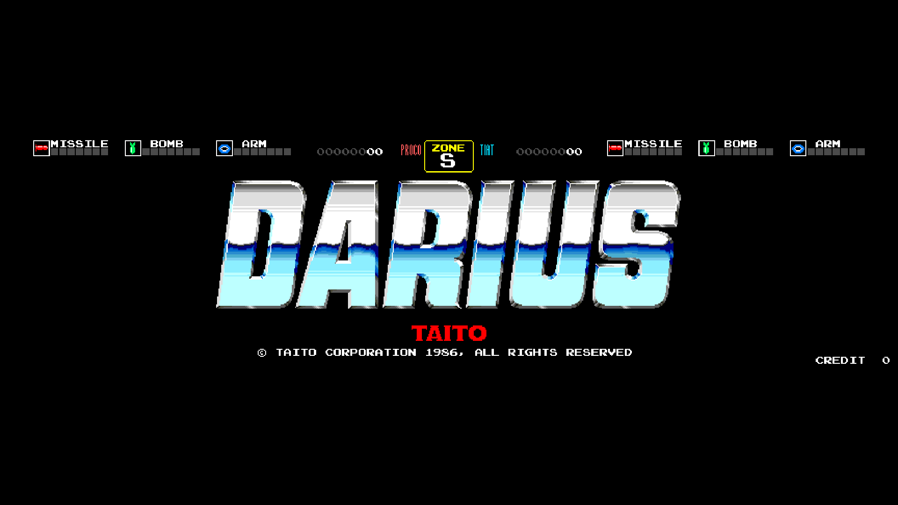
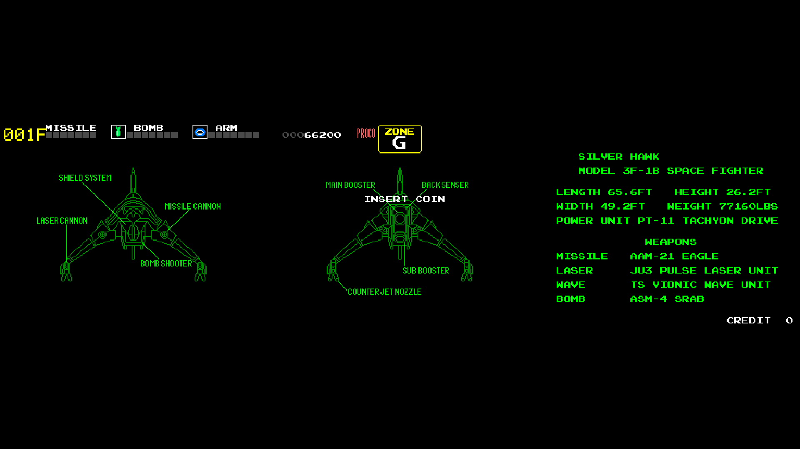
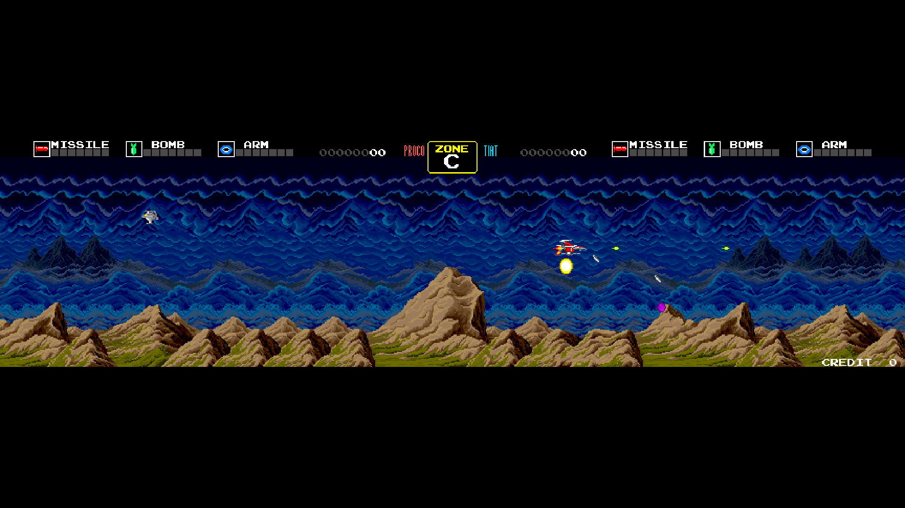
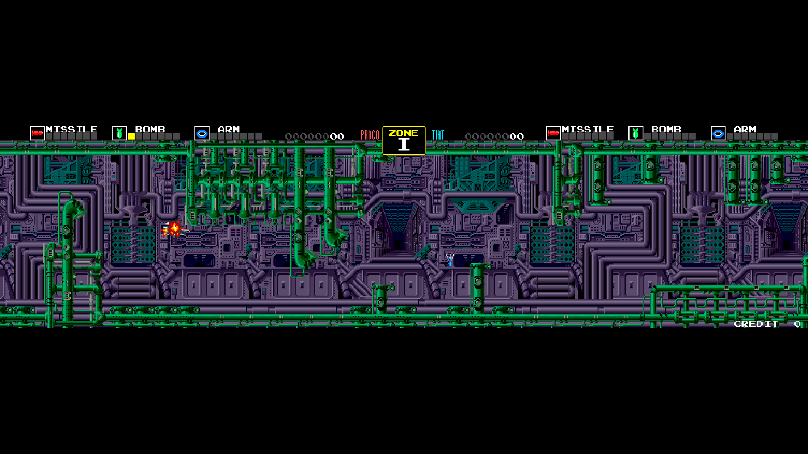
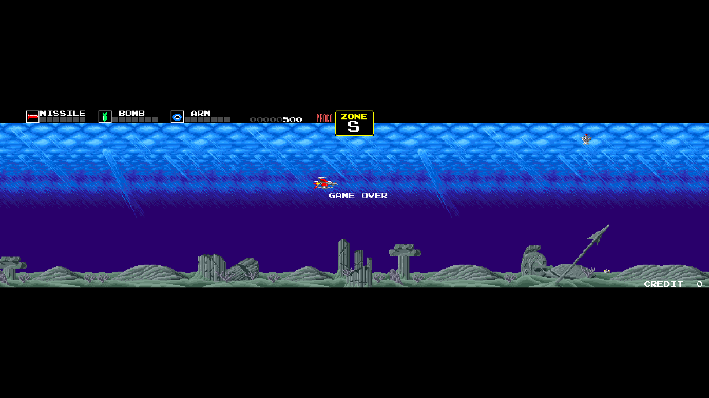
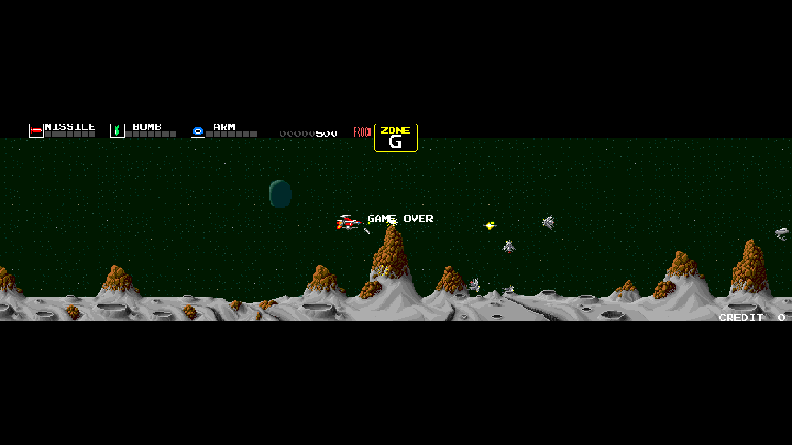

# Arcade-Darius_MiSTer

FPGA core for **Darius** (Taito Corporation, 1986) targeting the
[MiSTer FPGA](https://github.com/MiSTer-devel) platform (Terasic DE10-Nano).

Darius is a triple-screen horizontal shoot-'em-up running on a dual
68000 + Z80 × 2 board with two PC080SN tile layers, PC090OJ sprites,
PC060HA master/slave communication, and YM2203 ×2 + MSM5205 audio.
This core reimplements the hardware in SystemVerilog from MAME references
and hardware observation on original PCBs.

## Status

**Current version: 1.1** (May 2026)

The core runs the full game end-to-end on all supported ROM sets and
has been tested on real MiSTer hardware.

**What's new in v1.1**
- Pause overlay with project logo, scrolling supporters list (with tier
  colors: Bronze / Silver / Gold), and social links — your name in the
  credits if you support the project
- "Clean Pause" OSD option to bypass overlay (pause without dim/logo)
- Scale options refactored: Narrower HV-Integer (default), V-Integer,
  HV-Integer (Normal scaling removed — gave wrong results without
  precise user setup)
- HDMI_FREEZE removed (overlay rendered live, no scaler freeze)
- SignalTap probes removed (frees ~6 M10K)

**Features**
- Dual 68000 main/sub with shared RAM (FX68K core)
- Three horizontal panels composed into the 864-pixel virtual screen
- Sprite renderer with priority, flip, 16×16 4bpp tiles
- FG text/HUD layer with local BRAM text ROM
- Palette with MAME-verified byte order
- Audio: YM2203 ×2 (FM + PSG) + MSM5205 ADPCM with pan/volume routing
- PC060HA main/sub communication
- SDRAM arbitration for tile/sprite ROM and main/sub CPU fetch
- Inputs (coin, start, 8-way joystick) and full DIP switch support
- MiSTer OSD with video, pause and DIP options
- Pause overlay with supporters credits and social links

**ROM sets supported**
- Darius (World) — reference set
- Darius (US)
- Darius (Japan rev 1 — dariusj)
- Darius (Japan pure — dariuso)
- Darius Extra Version (dariuse)

**Notes**
- Audio pole filters currently bypassed (direct DC-removed signals to mixer)
- 15 kHz CRT output is **not currently supported** (non-standard 864×224
  resolution incompatible with the analog I/O board)
- For HDMI use the HDMI output directly. For 31 kHz VGA monitors use an
  HDMI→VGA adapter — do **not** enable Direct Video

## Screenshots

| | |
|---|---|
|  |  |
| Title screen | Attract — Silver Hawk briefing |
|  |  |
| Zone C | Zone I |
|  |  |
| Zone S | Zone G |

## Hardware requirements

- Terasic DE10-Nano
- MiSTer I/O board (recommended)
- SDRAM module (32 MB or 64 MB)
- HDMI display (recommended), or HDMI→VGA adapter for 31 kHz VGA monitors

**Note on video output**: The core works on standard HDMI displays.
For 31 kHz VGA monitors, use an HDMI→VGA adapter — do **not** enable
Direct Video. **15 kHz CRT output is not currently supported** because
the 864×224 triple-panel resolution is incompatible with the MiSTer
analog I/O board.

## Build from source

Requires **Quartus Prime Lite 17.0.x** for Cyclone V (5CSEBA6U23I7).

```bash
cd Arcade-Darius_MiSTer
quartus_sh --flow compile Darius -c Darius
```

Output: `output_files/Darius.rbf` (~3.9 MB).

## Running on MiSTer

The [releases/](releases/) folder contains the pre-built bitstream and
the parent MRA for the reference ROM set:

- `Darius_YYYYMMDD.rbf` — pre-built core bitstream
- `Darius (World).mra` — parent MRA (reference set)

Alternative ROM sets are provided in [releases/alternatives/](releases/alternatives/):

- `Darius (US).mra`
- `Darius (Japan).mra`
- `Darius (Japan, rev 1).mra`
- `Darius Extra Version (Japan).mra`

Following the MiSTer-devel convention, the alternative sets are also
mirrored to the official [MRA-Alternatives_MiSTer](https://github.com/MiSTer-devel/MRA-Alternatives_MiSTer)
repository, where they are picked up automatically by **Update_All**.

Steps:

1. Copy the `.rbf` to `_Arcade/cores/` on the MiSTer SD card.
2. Copy the desired `.mra` file(s) to `_Arcade/` on the MiSTer SD card.
3. Provide your legally-owned Darius ROM files where each MRA expects them
   (usually in `games/mame/`).
4. For HDMI displays, no special setup is required. For 31 kHz VGA
   monitors, use an HDMI→VGA adapter (do **not** enable Direct Video).
   15 kHz CRT output is not currently supported (see Hardware requirements).
5. The core OSD defaults to **Narrower HV-Integer** scale, which gives a
   proper integer-scaled image on modern HDMI displays. Other Scale
   options (V-Integer, HV-Integer) are available for custom setups.

**ROMs are NOT included in this repository.** You must provide them yourself.

## Repository layout

```
Arcade-Darius_MiSTer/
├── rtl/
│   ├── darius/       Darius-specific core RTL (Umberto Parisi)
│   ├── fx68k/        M68000 core (Jorge Cwik)
│   ├── jt12/         YM2203 FM synth (Jose Tejada)
│   ├── jt5205/       MSM5205 ADPCM (Jose Tejada)
│   ├── jtframe/      JTFRAME framework modules (Jose Tejada)
│   ├── t80/          Z80 core
│   ├── pll/          Clock PLL
│   └── sdram.sv      SDRAM controller (Sorgelig)
├── sys/              MiSTer framework (Sorgelig / MiSTer-devel)
├── releases/         Pre-built .rbf + parent MRA
│   └── alternatives/ MRA files for alternate ROM sets
├── docs/             Screenshots
├── Darius.qpf        Quartus project
├── Darius.qsf        Quartus assignments
├── Template.sv       Top-level wrapper
├── Template.sdc      Timing constraints
├── files.qip         HDL file list
├── build_id.v        Build version stamp
├── LICENSE           GNU GPL v3
├── AUTHORS.md        Credits and third-party licenses
└── README.md         This file
```

## License

Distributed under **GNU General Public License v3 or later**.
See [LICENSE](LICENSE) and [AUTHORS.md](AUTHORS.md) for credits and
third-party licensing.

GPL-3 is chosen to stay compatible with upstream GPL-3 dependencies
(JTFRAME, FX68K, Sorgelig's sdram and sys framework).

## Support this project

If you enjoy this core and want to support its development:

- [Ko-fi](https://ko-fi.com/ibecerivideoludici) — one-time support
- [Patreon](https://www.patreon.com/IBeceriVideoludici) — monthly support
- [PayPal](https://www.paypal.me/IBeceriVideoludici) — one-time donation

## Follow

- [Twitch](https://twitch.tv/ibecerivideoludici) — live streams
- [YouTube](https://www.youtube.com/c/IBeceriVideoludici/playlists) — playlists and videos

## Credits

Built on top of work by:

- **Jorge Cwik** — [FX68K](https://github.com/ijor/fx68k) (M68000 core)
- **Jose Tejada** / Jotego — [JTFRAME, JT12, JT5205](https://github.com/jotego/jtcores)
- **Sorgelig** and the **MiSTer-devel team** — framework, SDRAM controller
- The **MAME** project — invaluable hardware reference

Full list in [AUTHORS.md](AUTHORS.md).

Original Darius arcade hardware © Taito Corporation, 1986.
